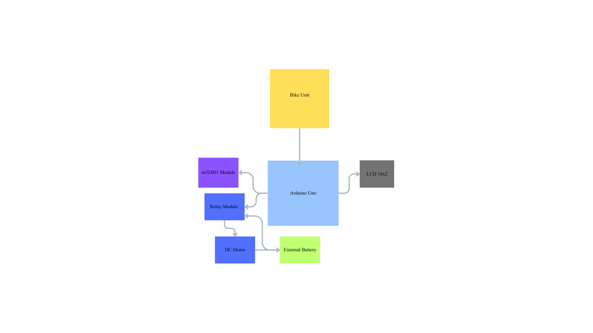

# Smart Safety Helmet with H2V Communication and Ignition Control

## 1. Introduction

Road safety continues to be a critical concern, particularly in two-wheeler transportation, where non-compliance with helmet usage and alcohol-influenced driving contribute significantly to accident-induced fatalities. Traditional helmets serve only as passive protective gear and have no functional interaction with the vehicle. There exists no automated mechanism capable of validating rider compliance before ignition.

This project presents a **Smart Safety Helmet System** integrated with **Helmet-to-Vehicle (H2V) communication**, enabling a real-time enforcement mechanism that verifies essential safety conditions—including helmet-wear status, alcohol level, accident impact, and wireless connectivity—before allowing vehicle ignition. By embedding sensing, computation, and communication within the helmet and the vehicle, the proposed system transforms the helmet into an **active safety component** rather than a passive one.

---

## 2. System Motivation

The primary motivations behind this work are:

1. **Helmet usage negligence**: Riders frequently operate motorcycles without helmets, despite legal mandates.
2. **Driving under the influence (DUI)**: Alcohol impairment remains a leading cause of road accidents. Tamil Nadu enforces a legal upper limit of **0.03% BAC (Blood Alcohol Concentration)**.
3. **Post-impact ignorance**: In the absence of intelligent detection, an accident may go unregistered and unnoticed.
4. **Lack of vehicle-helmet interaction**: Current ignition systems do not validate rider readiness.

This system attempts to enforce safety conditions autonomously, minimizing reliance on rider intent.

---

## 3. System Architecture Overview

The system comprises two units:

### 3.1 Helmet Unit

* Senses rider conditions.
* Performs local preprocessing.
* Transmits status wirelessly to the bike.

### 3.2 Bike Unit

* Receives helmet data.
* Implements decision logic.
* Controls ignition and displays real-time status.

This forms an H2V communication link.

---

## 4. Block Diagrams

### 4.1 Helmet Unit Block Diagram


### 4.2 Bike Unit Block Diagram



---

## 5. Circuit Diagrams

### 5.1 Helmet Circuit


### 5.2 Bike Circuit


---

## 6. Functional Description

### 6.1 Helmet Unit Operations

The helmet integrates the following sensors:

| Sensor   | Purpose                                                            |
| -------- | ------------------------------------------------------------------ |
| FSR      | Detects whether the helmet is physically worn                      |
| MQ-3     | Detects ethanol concentration in rider breath                      |
| MPU6050  | Detects abrupt acceleration changes indicating falls or collisions |
| nRF24L01 | Transmits processed data to bike unit                              |

### 6.2 Bike Unit Operations

* Receives the helmet telemetry.
* Estimates BAC from MQ-3 output.
* Compares conditions against preset safety rules.
* Displays warnings and states on LCD.
* Operates a relay to enable or disable engine ignition.

---

## 7. Safety Enforcement Logic

Ignition is **permitted only if all of the following conditions are satisfied**:

| Condition                        | Status | Action         |
| -------------------------------- | ------ | -------------- |
| Helmet worn                      | True   | Continue       |
| Estimated BAC ≤ 0.03% (TN limit) | True   | Continue       |
| No accident detected             | True   | Continue       |
| Wireless link active             | True   | Engine allowed |

Any single violation triggers ignition disablement (relay OFF) and corresponding alert messages.

Priority of decision-making:

1. Accident event
2. Helmet not worn
3. BAC above legal threshold
4. Successful safety compliance

The system defaults to **fail-safe shutdown** if communication is lost or corrupted.

---

## 8. Experimental Nature of Thresholds

**IMPORTANT**:
The following parameters used in this implementation are **experimental** and must be calibrated for real-time deployment:

* FSR force threshold for helmet detection
* MQ-3 analog values correlated to BAC estimation
* MPU6050 acceleration magnitude threshold for accident detection

Actual values depend on:

* Sensor placement
* Ambient conditions
* Calibration gas concentration for MQ-3
* Helmet fit variations
* Vehicle-specific shock damping characteristics

Therefore, these values **should not be treated as definitive engineering constants**. Field trials and statistical regression should be performed before production-grade adoption.

---

## 9. Repository Structure

```
Smart-Safety-Helmet-H2V/
│
├── code/
│   ├── helmet-side/helmet.ino
│   └── bike-side/bike.ino
│
├── hardware/
│       ├── helmet-circuit.png
│       └── bike-circuit.png
│
├── media/
│   ├── helmet-side-block.png
│   └── bike-side-block.png
│
└── README.md
```

---

## 10. Hardware Components

### Helmet Unit

* Arduino Uno
* Force Sensitive Resistor (FSR)
* MQ-3 Alcohol Sensor
* MPU6050 Accelerometer/Gyroscope
* nRF24L01 Wireless Transceiver

### Bike Unit

* Arduino Uno
* nRF24L01 Wireless Receiver
* 16×2 LCD (I2C)
* Relay Module (Ignition Control)
* DC Motor for ignition simulation

---

## 11. Originally Included and Removed Features

During early development, the system supported:

* **NEO-6M GPS module**
  Used for capturing accident location coordinates.
* **SIM800L GSM module**
  Used for transmitting accident alerts and GPS location via SMS to emergency contacts.

These modules were **removed from the final implementation** due to:

* Power isolation issues
* Network dependency constraints
* Project scope reduction

However, the software architecture has been kept modular. The following enhancement can be re-integrated seamlessly:

**Future Upgrade**:
Automatic accident alert message containing live GPS coordinates transmitted via GSM or IoT network to emergency services or predefined contacts.

This extension would elevate the system from a preventive safety gatekeeper to an active post-incident response framework.

---

## 12. Software Summary

**helmet.ino**

* Acquires rider condition data
* Packs and transmits structured status over nRF24L01

**bike.ino**

* Receives helmet data
* Computes estimated BAC
* Applies decision logic and operates relay + LCD

Both programs include inline comments to support code readability and future modifications.

---

## 13. Evaluation Summary

The system has been validated for:

* Continuous telemetry updates
* Real-time communication reliability
* Ignition gating accuracy
* Error handling under packet loss
* Fail-safe default response behavior

For production, environmental calibration and casing design are recommended.

---

## 14. Conclusion

This work demonstrates a fully integrated, sensor-driven, wireless safety enforcement system that upgrades the conventional helmet into an active component of vehicle control. The project provides a scalable framework for intelligent transportation systems and establishes a foundation for future extensions such as remote alerts, cloud analytics, and behavior profiling.

---

## 15. License

This project is released under the MIT License.

---

## 16. Author

R Hari Narayanan
B.Tech Computer and Communication Engineering
Amrita Vishwa Vidyapeetham
